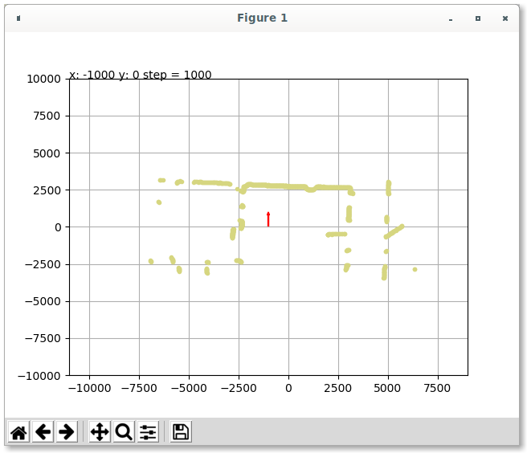
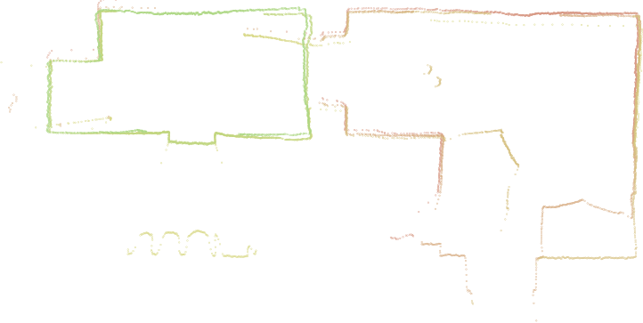

# Simple GUI application for lidar house mapping

This application offers simple house room mapping by using a (Hokuyo LX) lidar.

To simplify interaction with user, map is shown in matplotlib and only a few keyboard keys are watched.

| key    | effect                                       |
|--------|----------------------------------------------|
| arrows | move by predefined step in desired direction |
| o      | change lidar orientation (+90 degrees)       |
| x      | create scan                                  |
| u      | remove last scan                             |
| j      | change step of movement                      |

After each scan creation or deletion, data are exported to plan.svg, plan.csv (see examples) and shown in the plot.

## Installation

The application is written in Python 3 and depends on `hokuyolx`, `matplotlib` and `svgwrite` libraries (which can be installed by using pip3 `pip3 install xxx` or apt `sudo apt-get install python3-xxx`).

## How to use

A few steps to successfully obtain desired output:

* Take a measuring tape and mark several points on your floor with distances from zero point. 
* Set-up your lidar:
  * Connect via ethernet, set static IP address (192.168.0.XX) and right mask (24 or 255.255.255.0) in your adapter settings
  * The lidar should have IP address 192.168.0.10 (you can try to ping it by using `ping 192.168.0.10`)
* Move the lidar to the first position and take a scan (x)
* Move or rotate lidar and adjust position in the app (arrows, o, j)
* Take another screen (x) or remove if you are not satisfied with the result (u)
* ...
* Adjust scans in the resulting svg -- every scan is stored in one group with center point (position of lidar) and all measured points

## TODOs

Several nice to have things:

* After e.g. short power failure, the connection between computer and lidar is not recovered and you have to restart the app and connect multiple svgs afterwards.
* Live preview of lidar data
* Better shortcuts -- currently limited by matplotlib predefined shortcuts
